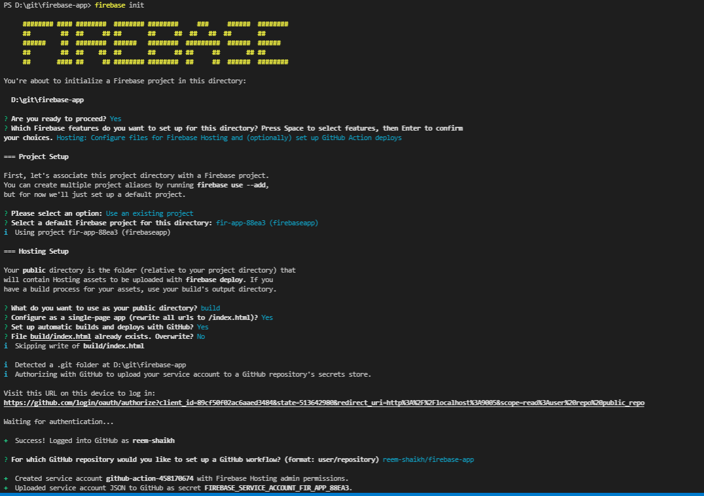

### Deploying a react app on firebase 
1. create a git repo 
2. create a repo on local with react project in it and git bash
```bash 
git init 
git remote add origin https://github.com/reem-shaikh/card-clone.git
npx create-react-app .
git add . 
git commit -m "added"
git pull 
git push -u origin master 
```
2. run npm run build on terminal

#### Set up firebase hosting 
1. Install Firebase CLI
To host your site with Firebase Hosting, you need the Firebase CLI (a command line tool).

> Run the following npm command to install the CLI or update to the latest CLI version.
```bash 
npm install -g firebase-tools
```


2. Initialize your project
Open a terminal window and navigate to or create a root directory for your web app

> type this command in terminal, to install  firebase globally
```bash 
Set-ExecutionPolicy -Scope Process -ExecutionPolicy Bypass
```
> Sign in to Google
```bash 
firebase login
```


> Initiate your project
Run this command from your app’s root directory:
```bash 
firebase init
```


> project will be hosted on a public folder called build in firebase. make sure you don't overwrite the builds.
- The last question is whether or not to overwrite your existing build/index.htmlfile. So You'll want to enter N (No) for this option because we want actual index.html file that Reacts is generated while creating the build.

> Deploy React app
Now that everything is set up, you can go ahead and deploy your app! The only thing you need to do is run the following command:
```bash 
firebase deploy
```


```bash 
Project Console: https://console.firebase.google.com/project/fir-app-88ea3/overview
Hosting URL: https://fir-app-88ea3.web.app
```
-----

#### Deployment on firebase gives a welcome screen issue? 
if after deploying your react app, you get this welcome screen pop up, when you navigate to your website URL, its mainly because react firebase is overwriting your build/index.html file while performing the build.

> In order to fix that, you need to replace the code inside your build/index.html file, from this 
to this, 
Here's the code snippet, copy paste this, inside your `build/index.html` file. 
```bash
<!DOCTYPE html> <html lang="en">   <head>     <meta charset="utf-8" />     <link rel="icon" href="%PUBLIC_URL%/favicon.ico" />     <meta name="viewport" content="width=device-width, initial-scale=1" />     <meta name="theme-color" content="#000000" />     <meta       name="description"       content="Web Chat Application created using professional technologies"      />     <link rel="apple-touch-icon" href="%PUBLIC_URL%/logo192.png" />     <!--       manifest.json provides metadata used when your web app is installed on a       user's mobile device or desktop. See https://developers.google.com/web/fundamentals/web-app-manifest/     -->     <link rel="manifest" href="%PUBLIC_URL%/manifest.json" />     <!--       Notice the use of %PUBLIC_URL% in the tags above.       It will be replaced with the URL of the `public` folder during the build.       Only files inside the `public` folder can be referenced from the HTML.        Unlike "/favicon.ico" or "favicon.ico", "%PUBLIC_URL%/favicon.ico" will       work correctly both with client-side routing and a non-root public URL.       Learn how to configure a non-root public URL by running `npm run build`.     -->     <title>Ruby</title>   </head>   <body>     <noscript>You need to enable JavaScript to run this app.</noscript>     <div id="root"></div>     <!--       This HTML file is a template.       If you open it directly in the browser, you will see an empty page.        You can add webfonts, meta tags, or analytics to this file.       The build step will place the bundled scripts into the <body> tag. To begin the development, run `npm start` or `yarn start`.       To create a production bundle, use `npm run build` or `yarn build`.     -->   </body> </html>
```
> After doing this, Delete the following files from your project directory:
- Delete .firebaserc file.
- Delete firebase.json file.
- Delete ".firebase" folder.
- Delete "build" folder.

> For Initializing the firebase in your react app, run the following code in your terminal / git bash.
```bash
firebase init
```
> Select the following options in the next process:
- Which Firebase features do you want to set up for this directory? Press Space to select features, then Enter to confirm your choices. Hosting: Configure files for Firebase Hosting and (optionally) set up GitHub Action deploys
- Please select an option: Use an existing project
- Select a default Firebase project for this directory: web-chat-application-programmer-dost (Web-Chat-Application-Programmer-Dost)
- Type the folder name where you want to initialize the app. It would be build in case of react app.

- What do you want to use as your public directory? build
- Select Yes in single page app

- Configure as a single-page app (rewrite all urls to /index.html)? Yes
- I am currently selecting "No" for uploading code in github.

- Set up automatic builds and deploys with GitHub? No
- After completion of firebase initialization, you need to run the production build. For NPM, run the following code in the terminal:
```bash
npm run build
```
> now deploy this react app in the firebase again:
```bash
firebase deploy
```
Run this command in the terminal and all done. Refresh the hosted URL and your react app would be functioning right now.

> the react app (from this tutorial) is hosted on these 2 domains:
- https://fir-app-88ea3.web.app/
- https://fir-app-88ea3.firebaseapp.com/
