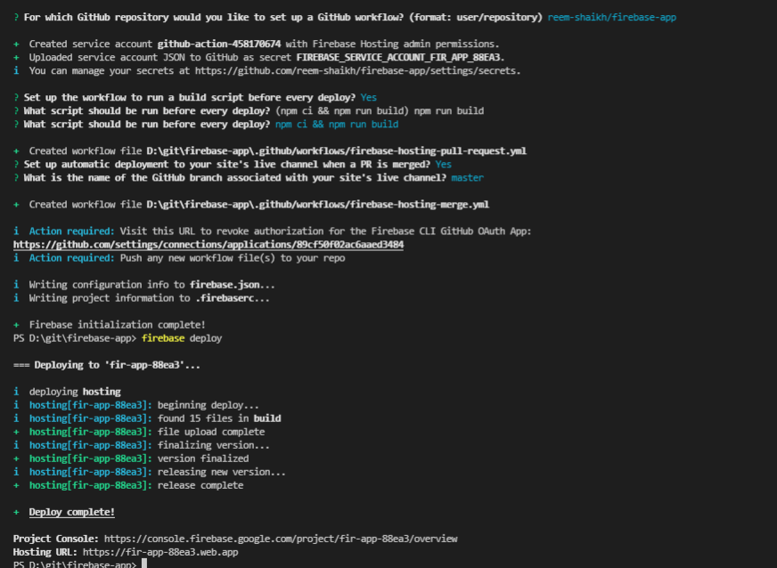

### Deploying a react app on firebase 
1. create a git repo 
2. create a repo on local with react project in it and git bash
```bash 
git init 
git remote add origin https://github.com/reem-shaikh/card-clone.git
npx create-react-app .
git add . 
git commit -m "added"
git pull 
git push -u origin master 
```
2. run npm run build on terminal

#### Set up firebase hosting 
1. Install Firebase CLI
To host your site with Firebase Hosting, you need the Firebase CLI (a command line tool).

> Run the following npm command to install the CLI or update to the latest CLI version.
```bash 
npm install -g firebase-tools
```


2. Initialize your project
Open a terminal window and navigate to or create a root directory for your web app

> type this command in terminal, to install  firebase globally
```bash 
Set-ExecutionPolicy -Scope Process -ExecutionPolicy Bypass
```
> Sign in to Google
```bash 
firebase login
```


> Initiate your project
Run this command from your app’s root directory:
```bash 
firebase init
```


> project will be hosted on a public folder called build in firebase. make sure you don't overwrite the builds.
- The last question is whether or not to overwrite your existing build/index.htmlfile. So You'll want to enter N (No) for this option because we want actual index.html file that Reacts is generated while creating the build.

> Deploy React app
Now that everything is set up, you can go ahead and deploy your app! The only thing you need to do is run the following command:
```bash 
firebase deploy
```


```bash 
Project Console: https://console.firebase.google.com/project/fir-app-88ea3/overview
Hosting URL: https://fir-app-88ea3.web.app
```
-----

> the react app is hosted at these 2 domains:
- https://fir-app-88ea3.web.app/
- https://fir-app-88ea3.firebaseapp.com/

